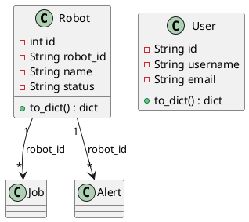
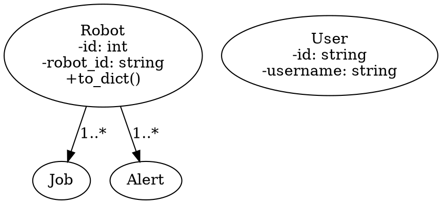

# TonyPi Monitoring System - Class Diagram

## System Overview

This class diagram illustrates the architecture of the TonyPi Robot Monitoring System, including backend models, services, and robot client components.

---

## Complete Class Diagram (Mermaid)

```mermaid
classDiagram
    direction TB
    
    %% ============================================
    %% DATABASE MODELS (PostgreSQL via SQLAlchemy)
    %% ============================================
    
    class Base {
        <<abstract>>
        +metadata
    }
    
    class Robot {
        +int id
        +str robot_id
        +str name
        +str description
        +JSON location
        +str status
        +str ip_address
        +str camera_url
        +float battery_threshold_low
        +float battery_threshold_critical
        +float temp_threshold_warning
        +float temp_threshold_critical
        +JSON settings
        +DateTime last_seen
        +DateTime created_at
        +DateTime updated_at
        +bool is_active
        +to_dict() dict
    }
    
    class User {
        +str id
        +str username
        +str email
        +str password_hash
        +str role
        +bool is_active
        +DateTime created_at
        +DateTime updated_at
        +to_dict() dict
    }
    
    class Job {
        +int id
        +str robot_id
        +DateTime start_time
        +DateTime end_time
        +int items_total
        +int items_done
        +float percent_complete
        +JSON last_item
        +str status
        +DateTime created_at
        +DateTime updated_at
        +to_dict() dict
    }
    
    class Report {
        +int id
        +str title
        +str description
        +str robot_id
        +str report_type
        +JSON data
        +str file_path
        +DateTime created_at
        +str created_by
        +to_dict() dict
    }
    
    class Alert {
        +int id
        +str robot_id
        +str alert_type
        +str severity
        +str title
        +str message
        +str source
        +float value
        +float threshold
        +bool acknowledged
        +str acknowledged_by
        +DateTime acknowledged_at
        +bool resolved
        +DateTime resolved_at
        +JSON details
        +DateTime created_at
        +to_dict() dict
    }
    
    class AlertThreshold {
        +int id
        +str robot_id
        +str metric_type
        +float warning_threshold
        +float critical_threshold
        +bool enabled
        +DateTime created_at
        +DateTime updated_at
        +to_dict() dict
    }
    
    class SystemLog {
        +int id
        +str level
        +str category
        +str message
        +str robot_id
        +JSON details
        +DateTime timestamp
        +to_dict() dict
    }
    
    %% Model Inheritance
    Base <|-- Robot
    Base <|-- User
    Base <|-- Job
    Base <|-- Report
    Base <|-- Alert
    Base <|-- AlertThreshold
    Base <|-- SystemLog
    
    %% ============================================
    %% DATABASE SERVICES
    %% ============================================
    
    class DatabaseConnection {
        <<singleton>>
        +str POSTGRES_URL
        +Engine engine
        +SessionLocal sessionmaker
        +Base declarative_base
        +get_db() Generator
    }
    
    class InfluxClient {
        +str url
        +str token
        +str org
        +str bucket
        +InfluxDBClient client
        +WriteApi write_api
        +QueryApi query_api
        +dict SENSOR_TYPES
        +list LOG_LEVELS
        +write_sensor_data(measurement, tags, fields) bool
        +write_validated_sensor(robot_id, sensor_type, value) bool
        +write_servo_data(robot_id, servo_id, ...) bool
        +write_vision_data(robot_id, detection, state, ...) bool
        +write_log_entry(robot_id, level, message, source) bool
        +write_battery_status(robot_id, percentage, voltage) bool
        +write_location(robot_id, x, y, z) bool
        +query_recent_data(measurement, time_range, robot_id) list
        +query_sensor_history(robot_id, sensor_type, time_range) list
        +query_vision_events(robot_id, time_range) list
        +query_robot_logs(robot_id, time_range, level) list
        +get_latest_status(robot_id) dict
        +close()
    }
    
    %% ============================================
    %% MQTT CLIENT
    %% ============================================
    
    class MQTTClient {
        +str broker_host
        +int broker_port
        +str username
        +str password
        +mqtt.Client client
        +list topics
        +dict DEFAULT_THRESHOLDS
        +on_connect(client, userdata, flags, rc)
        +on_message(client, userdata, msg)
        +on_disconnect(client, userdata, rc)
        +handle_sensor_data(topic, payload)
        +handle_status_data(topic, payload)
        +handle_location_data(payload)
        +handle_battery_data(payload)
        +handle_servo_data(topic, payload)
        +handle_vision_data(topic, payload)
        +handle_log_data(topic, payload)
        +handle_scan(topic, payload)
        +handle_job_event(topic, payload)
        +handle_command_response(payload)
        +start() async
        +stop() async
        +publish_command(topic, data) bool
        +publish(topic, payload) async
        -_update_robot_status(robot_id, status, ip, camera_url)
        -_log_system_event(level, category, message, ...)
        -_get_threshold(metric_type, robot_id) dict
        -_check_and_create_alert(robot_id, metric_type, value, ...)
        -_create_alert(robot_id, alert_type, severity, ...)
    }
    
    %% ============================================
    %% AI ANALYTICS SERVICE
    %% ============================================
    
    class GeminiAnalytics {
        +str api_key
        +GenerativeModel model
        +is_available() bool
        +analyze_performance_data(data) async dict
        +analyze_job_data(data) async dict
        +analyze_servo_data(servo_data) async dict
        +generate_summary(performance_data, job_data, robot_id) async str
    }
    
    %% ============================================
    %% FASTAPI APPLICATION
    %% ============================================
    
    class FastAPIApp {
        <<application>>
        +str title
        +str description
        +str version
        +lifespan(app) asynccontextmanager
        +init_database()
        +wait_for_db(max_retries, delay) bool
    }
    
    class Router {
        <<interface>>
        +APIRouter router
    }
    
    class HealthRouter {
        +get_health() dict
        +get_detailed_health() dict
    }
    
    class RobotDataRouter {
        +get_robots() list
        +get_robot_data(robot_id) dict
        +get_sensor_data(robot_id, sensor_type) list
        +get_servo_data(robot_id) list
    }
    
    class ReportsRouter {
        +get_reports() list
        +create_report(data) Report
        +get_report(id) Report
        +generate_pdf_report(robot_id, report_type) bytes
    }
    
    class AlertsRouter {
        +get_alerts(filters) list
        +get_alert_stats() AlertStats
        +acknowledge_alert(id, user) Alert
        +resolve_alert(id) Alert
        +get_thresholds() list
        +update_threshold(id, data) AlertThreshold
    }
    
    class LogsRouter {
        +get_logs(filters) list
        +get_log_stats() LogStats
    }
    
    class UsersRouter {
        +login(credentials) Token
        +get_current_user(token) User
        +get_users() list
        +create_user(data) User
        +update_user(id, data) User
    }
    
    class ManagementRouter {
        +send_command(robot_id, command) CommandResponse
        +get_robot_status(robot_id) dict
    }
    
    class RobotsDBRouter {
        +get_robots() list
        +get_robot(robot_id) Robot
        +create_robot(data) Robot
        +update_robot(robot_id, data) Robot
        +delete_robot(robot_id) bool
    }
    
    Router <|.. HealthRouter
    Router <|.. RobotDataRouter
    Router <|.. ReportsRouter
    Router <|.. AlertsRouter
    Router <|.. LogsRouter
    Router <|.. UsersRouter
    Router <|.. ManagementRouter
    Router <|.. RobotsDBRouter
    
    %% ============================================
    %% ROBOT CLIENT (Runs on TonyPi/Raspberry Pi)
    %% ============================================
    
    class TonyPiRobotClient {
        +str mqtt_broker
        +int mqtt_port
        +str robot_id
        +mqtt.Client client
        +bool is_connected
        +bool running
        +bool hardware_available
        +LightSensor light_sensor
        +float battery_level
        +dict location
        +dict sensors
        +str status
        +dict servo_data
        +dict topics
        +list SERVO_NAMES
        +int SERVO_COUNT
        +on_connect(client, userdata, flags, rc)
        +on_disconnect(client, userdata, flags, rc)
        +on_message(client, userdata, msg)
        +handle_move_command(payload) dict
        +handle_stop_command(payload) dict
        +handle_head_nod(payload) dict
        +handle_head_shake(payload) dict
        +handle_status_request(payload) dict
        +handle_battery_request(payload) dict
        +handle_shutdown_command(payload) dict
        +get_system_info() dict
        +get_cpu_temperature() float
        +get_local_ip() str
        +get_battery_percentage() float
        +read_sensors() dict
        +get_servo_status() dict
        +send_sensor_data()
        +send_servo_data()
        +send_battery_status()
        +send_location_update()
        +send_status_update()
        +send_vision_data(detection_result)
        +send_log_message(level, message, source)
        +connect() async
        +disconnect() async
        +run() async
    }
    
    class LightSensor {
        +int pin
        +bool initialized
        +is_dark() bool
        +get_light_level() int
        +cleanup()
    }
    
    class HiwonderSDK {
        <<external>>
        +Board board
        +Controller controller
        +Sonar sonar
        +runActionGroup(action)
        +stopActionGroup()
        +executeMovement(direction)
    }
    
    TonyPiRobotClient --> LightSensor : uses
    TonyPiRobotClient --> HiwonderSDK : uses (optional)
    
    %% ============================================
    %% RELATIONSHIPS
    %% ============================================
    
    FastAPIApp --> DatabaseConnection : uses
    FastAPIApp --> MQTTClient : manages
    FastAPIApp --> HealthRouter : includes
    FastAPIApp --> RobotDataRouter : includes
    FastAPIApp --> ReportsRouter : includes
    FastAPIApp --> AlertsRouter : includes
    FastAPIApp --> LogsRouter : includes
    FastAPIApp --> UsersRouter : includes
    FastAPIApp --> ManagementRouter : includes
    FastAPIApp --> RobotsDBRouter : includes
    
    MQTTClient --> InfluxClient : writes data to
    MQTTClient --> DatabaseConnection : uses
    MQTTClient --> Robot : creates/updates
    MQTTClient --> Alert : creates
    MQTTClient --> AlertThreshold : reads
    MQTTClient --> SystemLog : creates
    
    ReportsRouter --> GeminiAnalytics : uses
    ReportsRouter --> InfluxClient : queries
    
    RobotDataRouter --> InfluxClient : queries
    AlertsRouter --> Alert : manages
    AlertsRouter --> AlertThreshold : manages
    LogsRouter --> SystemLog : queries
    RobotsDBRouter --> Robot : manages
    UsersRouter --> User : manages
    
    TonyPiRobotClient ..> MQTTClient : publishes to (via MQTT broker)
    
    %% Foreign Key-like relationships
    Job "0..*" --> "1" Robot : robot_id
    Report "0..*" --> "0..1" Robot : robot_id
    Alert "0..*" --> "0..1" Robot : robot_id
    AlertThreshold "0..*" --> "0..1" Robot : robot_id
    SystemLog "0..*" --> "0..1" Robot : robot_id
```



---

## Component Descriptions

### Database Models (PostgreSQL)

| Model | Description |
|-------|-------------|
| **Robot** | Stores robot configuration, status, thresholds, and metadata |
| **User** | User accounts for authentication (admin, operator, viewer roles) |
| **Job** | Tracks job/task progress, items processed, completion status |
| **Report** | Generated reports with data and optional PDF file paths |
| **Alert** | System alerts with severity levels, acknowledgment status |
| **AlertThreshold** | Configurable thresholds per robot or global defaults |
| **SystemLog** | System events and activity logs by category and level |

### Services

| Service | Description |
|---------|-------------|
| **InfluxClient** | Time-series database client for sensor, servo, vision, and log data |
| **MQTTClient** | Message broker client handling robot telemetry and commands |
| **GeminiAnalytics** | AI-powered analytics for performance and maintenance insights |

### Robot Client

| Component | Description |
|-----------|-------------|
| **TonyPiRobotClient** | Main robot client running on Raspberry Pi, handles telemetry and commands |
| **LightSensor** | GPIO-based light sensor for ambient light detection |
| **HiwonderSDK** | External SDK for TonyPi hardware (servos, IMU, sonar) |

---

## Data Flow Diagram

```
┌─────────────────────────────────────────────────────────────────────────┐
│                         MONITORING SERVER                                │
│                                                                          │
│  ┌──────────────┐    ┌──────────────┐    ┌──────────────┐              │
│  │   Frontend   │◄──►│   FastAPI    │◄──►│   Grafana    │              │
│  │  (React.js)  │    │   Backend    │    │  Dashboard   │              │
│  └──────────────┘    └──────┬───────┘    └──────┬───────┘              │
│                             │                    │                       │
│                    ┌────────┴────────┐          │                       │
│                    │                 │          │                       │
│              ┌─────▼─────┐    ┌──────▼──────┐  │                       │
│              │PostgreSQL │    │  InfluxDB   │◄─┘                       │
│              │ (Models)  │    │(Time-Series)│                          │
│              └───────────┘    └─────────────┘                          │
│                    ▲                 ▲                                  │
│                    │                 │                                  │
│              ┌─────┴─────────────────┴─────┐                           │
│              │        MQTT Client          │                           │
│              └─────────────┬───────────────┘                           │
│                            │                                            │
└────────────────────────────┼────────────────────────────────────────────┘
                             │ MQTT (port 1883)
                             │
┌────────────────────────────┼────────────────────────────────────────────┐
│                            │                                            │
│              ┌─────────────▼───────────────┐                           │
│              │    TonyPiRobotClient        │                           │
│              │    (Raspberry Pi)           │                           │
│              └─────────────┬───────────────┘                           │
│                            │                                            │
│         ┌──────────────────┼──────────────────┐                        │
│         │                  │                  │                        │
│   ┌─────▼─────┐     ┌──────▼──────┐    ┌─────▼─────┐                  │
│   │  Sensors  │     │   Servos    │    │  Camera   │                  │
│   │ IMU/Light │     │ (6 motors)  │    │  Stream   │                  │
│   └───────────┘     └─────────────┘    └───────────┘                  │
│                                                                         │
│                      TONYPI ROBOT                                       │
└─────────────────────────────────────────────────────────────────────────┘
```

---

## MQTT Topics

| Topic Pattern | Direction | Data Type |
|---------------|-----------|-----------|
| `tonypi/sensors/{robot_id}` | Robot → Server | Sensor readings (IMU, temperature, light) |
| `tonypi/status/{robot_id}` | Robot → Server | Robot status & system info |
| `tonypi/servos/{robot_id}` | Robot → Server | Servo position, temp, voltage |
| `tonypi/vision/{robot_id}` | Robot → Server | Vision detection results |
| `tonypi/logs/{robot_id}` | Robot → Server | Robot terminal logs |
| `tonypi/battery` | Robot → Server | Battery percentage & voltage |
| `tonypi/location` | Robot → Server | Position coordinates |
| `tonypi/commands/{robot_id}` | Server → Robot | Movement & control commands |
| `tonypi/commands/response` | Robot → Server | Command execution results |
| `tonypi/scan/{robot_id}` | Robot → Server | QR code scan events |
| `tonypi/job/{robot_id}` | Robot → Server | Job progress updates |

---

## Entity Relationships

```
┌─────────────┐       ┌─────────────┐
│    Robot    │       │    User     │
├─────────────┤       ├─────────────┤
│ PK: id      │       │ PK: id      │
│ UK: robot_id│       │ UK: username│
└──────┬──────┘       │ UK: email   │
       │              └─────────────┘
       │
       │ 1:N
       │
┌──────┴──────┬──────────────┬──────────────┬──────────────┐
│             │              │              │              │
▼             ▼              ▼              ▼              ▼
┌─────────┐ ┌─────────┐ ┌─────────┐ ┌───────────┐ ┌─────────────┐
│   Job   │ │ Report  │ │  Alert  │ │SystemLog  │ │AlertThreshold│
├─────────┤ ├─────────┤ ├─────────┤ ├───────────┤ ├─────────────┤
│ PK: id  │ │ PK: id  │ │ PK: id  │ │ PK: id    │ │ PK: id      │
│FK:robot │ │FK:robot │ │FK:robot │ │ FK:robot  │ │ FK:robot    │
│   _id   │ │   _id   │ │   _id   │ │    _id    │ │    _id      │
└─────────┘ └─────────┘ └─────────┘ └───────────┘ └─────────────┘
```

---

## Technology Stack

| Layer | Technology |
|-------|------------|
| **Frontend** | React.js, TypeScript, TailwindCSS |
| **Backend API** | FastAPI (Python) |
| **Relational DB** | PostgreSQL (via SQLAlchemy) |
| **Time-Series DB** | InfluxDB |
| **Message Broker** | Mosquitto (MQTT) |
| **Visualization** | Grafana |
| **AI Analytics** | Google Gemini API |
| **Robot Platform** | Raspberry Pi + HiWonder TonyPi SDK |
| **Containerization** | Docker, Docker Compose |

---

## Free Alternatives to Mermaid

Here are several **free alternatives** for creating class diagrams:

### 1. **PlantUML** (Recommended)

**Pros:**
- ✅ More powerful UML syntax than Mermaid
- ✅ Better support for complex relationships
- ✅ Can generate images (PNG, SVG, PDF)
- ✅ Works offline with Java
- ✅ VS Code extension available
- ✅ Free and open-source

**Online Editor:** http://www.plantuml.com/plantuml/uml/

**VS Code Extension:** Search "PlantUML" in VS Code extensions

**Example:**


---

### 2. **Draw.io (diagrams.net)**

**Pros:**
- ✅ Completely free, no account needed
- ✅ Visual drag-and-drop interface
- ✅ Works in browser or desktop app
- ✅ Exports to PNG, SVG, PDF, etc.
- ✅ Can save to Google Drive, OneDrive, or local
- ✅ Great for non-programmers

**Website:** https://app.diagrams.net/ (or https://draw.io)

**Desktop App:** Available for Windows, Mac, Linux

---

### 3. **yEd Graph Editor**

**Pros:**
- ✅ Free desktop application
- ✅ Automatic layout algorithms
- ✅ Professional-looking diagrams
- ✅ Exports to many formats
- ✅ No internet required

**Download:** https://www.yworks.com/products/yed

---

### 4. **Lucidchart** (Free Tier)

**Pros:**
- ✅ Easy to use web-based tool
- ✅ Professional templates
- ✅ Collaboration features
- ⚠️ Free tier limited to 3 documents

**Website:** https://www.lucidchart.com/

---

### 5. **UMLet**

**Pros:**
- ✅ Standalone Java application
- ✅ Fast and lightweight
- ✅ Text-based or visual editing
- ✅ Free and open-source

**Download:** https://www.umlet.com/

---

### 6. **Graphviz (DOT language)**

**Pros:**
- ✅ Text-based like Mermaid
- ✅ Very powerful layout engine
- ✅ Free and open-source
- ✅ Can be integrated into code

**Website:** https://graphviz.org/

**Example:**


---

### 7. **Structurizr Lite**

**Pros:**
- ✅ Free for small teams
- ✅ C4 model support
- ✅ Architecture diagrams
- ✅ Docker container available

**Website:** https://structurizr.com/

---

### 8. **Visual Studio Code Extensions**

**Free Extensions:**
- **PlantUML** - Render PlantUML diagrams
- **Draw.io Integration** - Edit .drawio files in VS Code
- **Mermaid Preview** - Preview Mermaid diagrams
- **Graphviz Preview** - Preview DOT files

---

## Quick Comparison

| Tool | Type | Learning Curve | Best For |
|------|------|----------------|----------|
| **PlantUML** | Text-based | Medium | Developers, complex UML |
| **Draw.io** | Visual | Easy | Non-developers, quick diagrams |
| **yEd** | Desktop | Medium | Professional diagrams |
| **Graphviz** | Text-based | Medium-Hard | Complex graph layouts |
| **Mermaid** | Text-based | Easy | Simple diagrams, GitHub |

---

## Recommendation

For your class diagram, I recommend:

1. **PlantUML** - If you want text-based with better UML support
2. **Draw.io** - If you prefer visual editing
3. **Keep Mermaid** - If you want GitHub-native rendering

Would you like me to convert the class diagram to **PlantUML** format?
