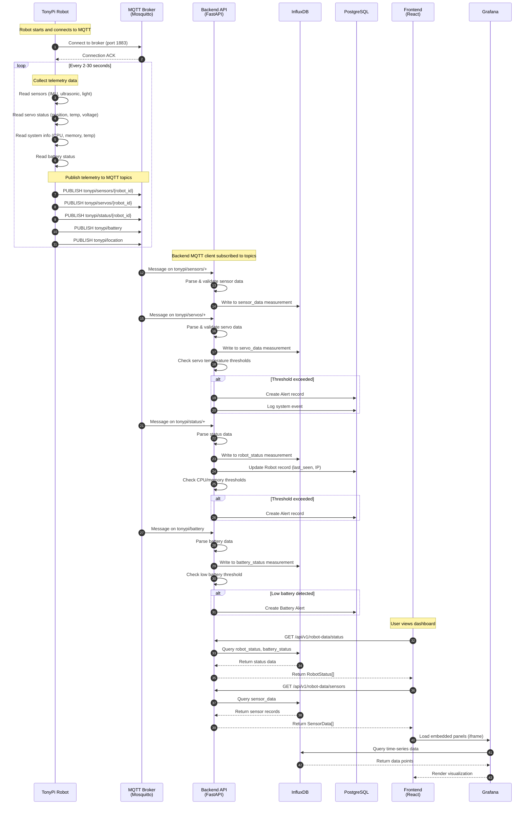
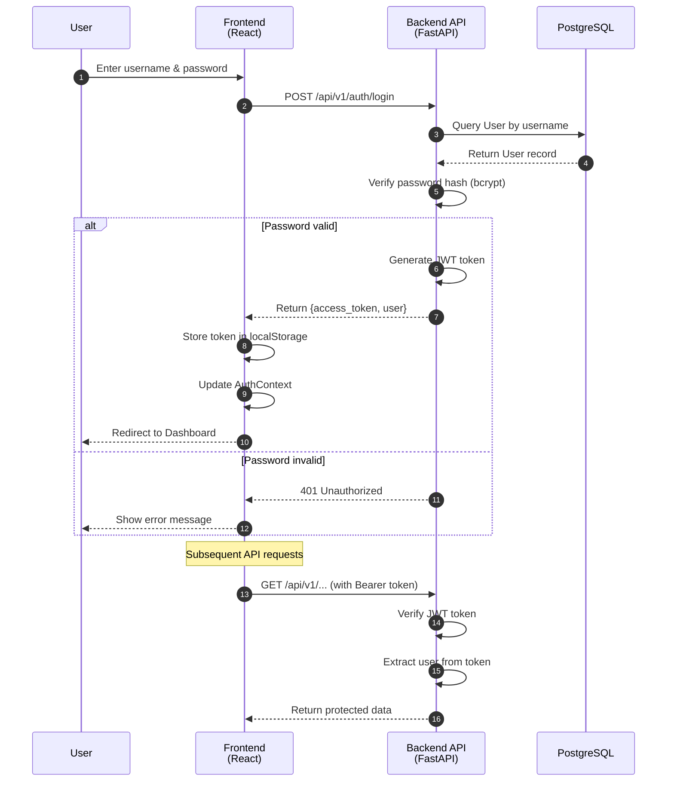
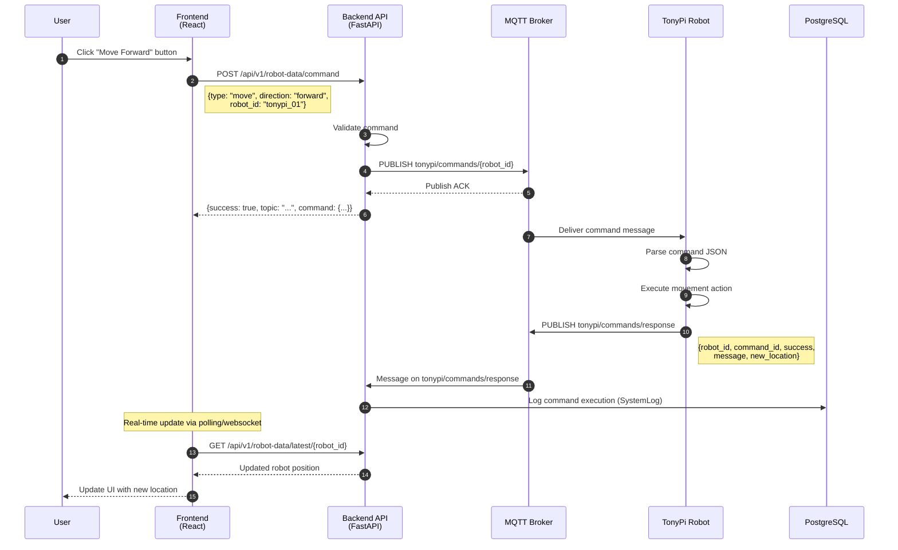
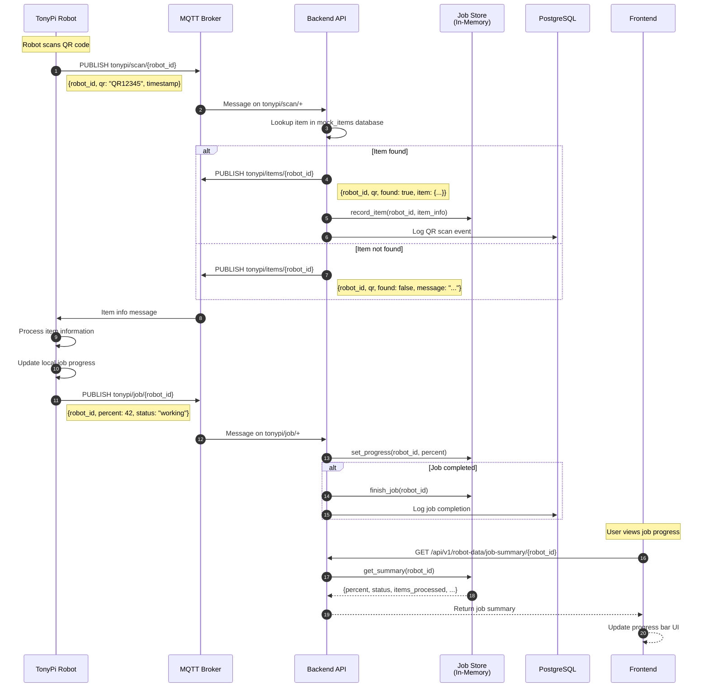
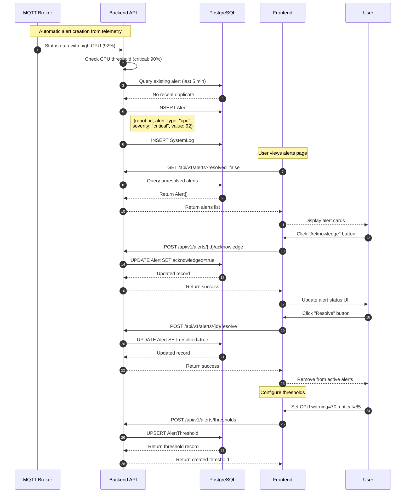
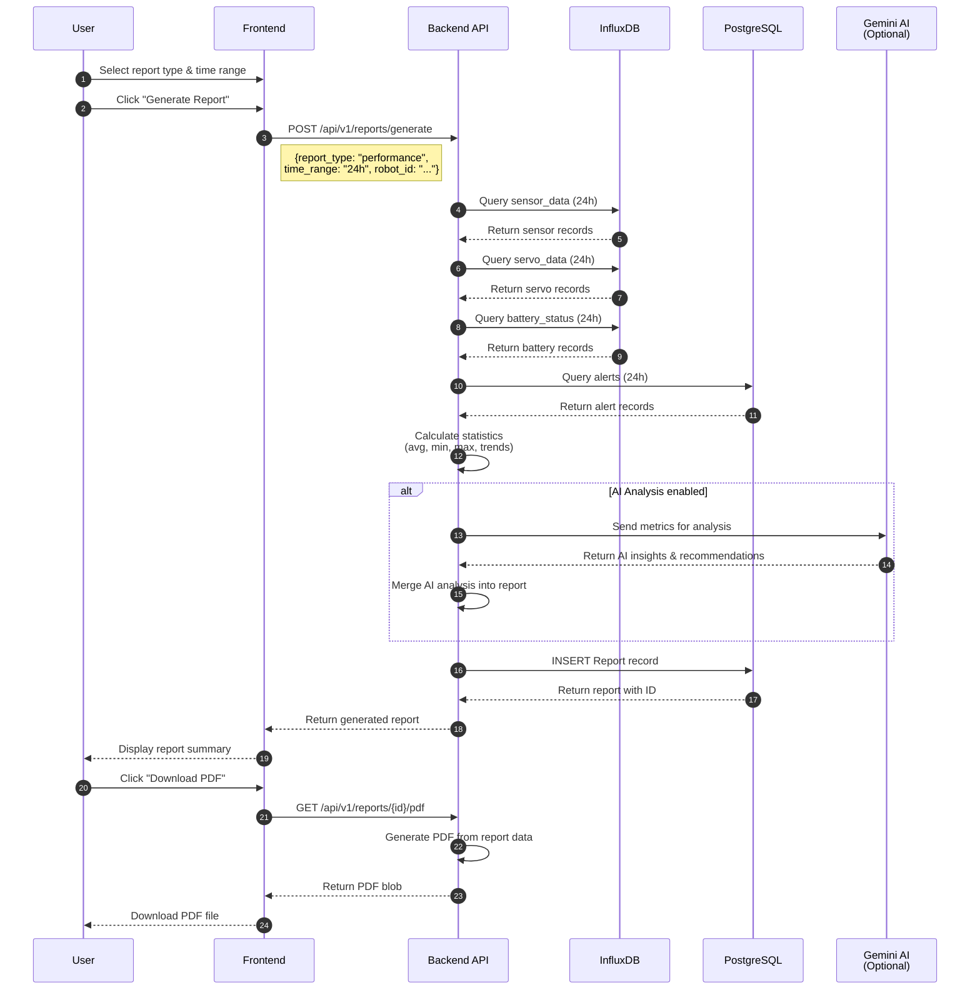
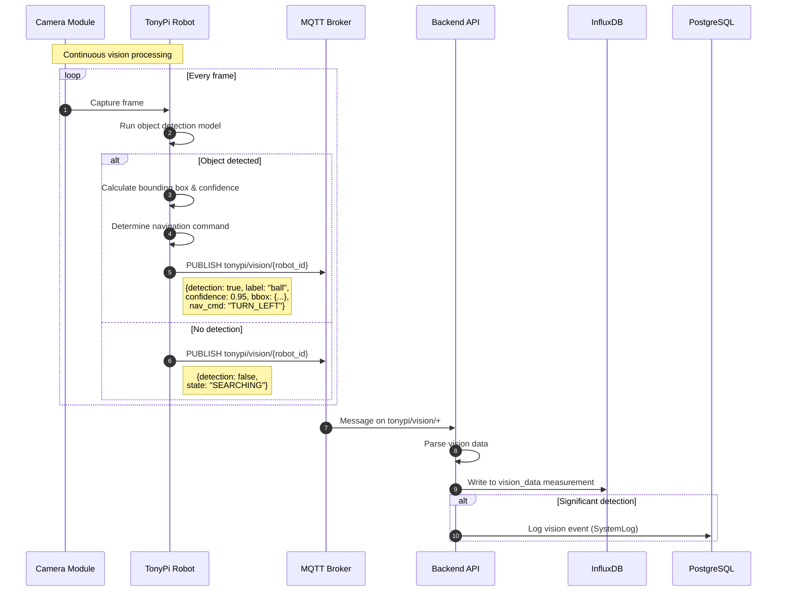
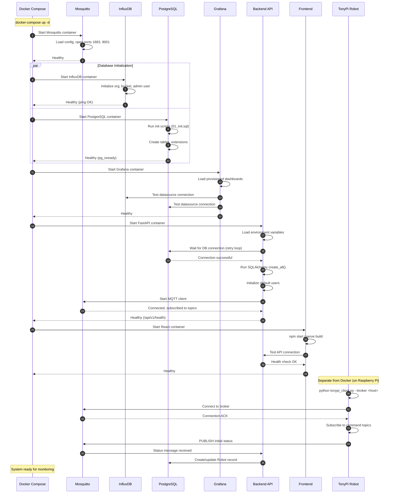
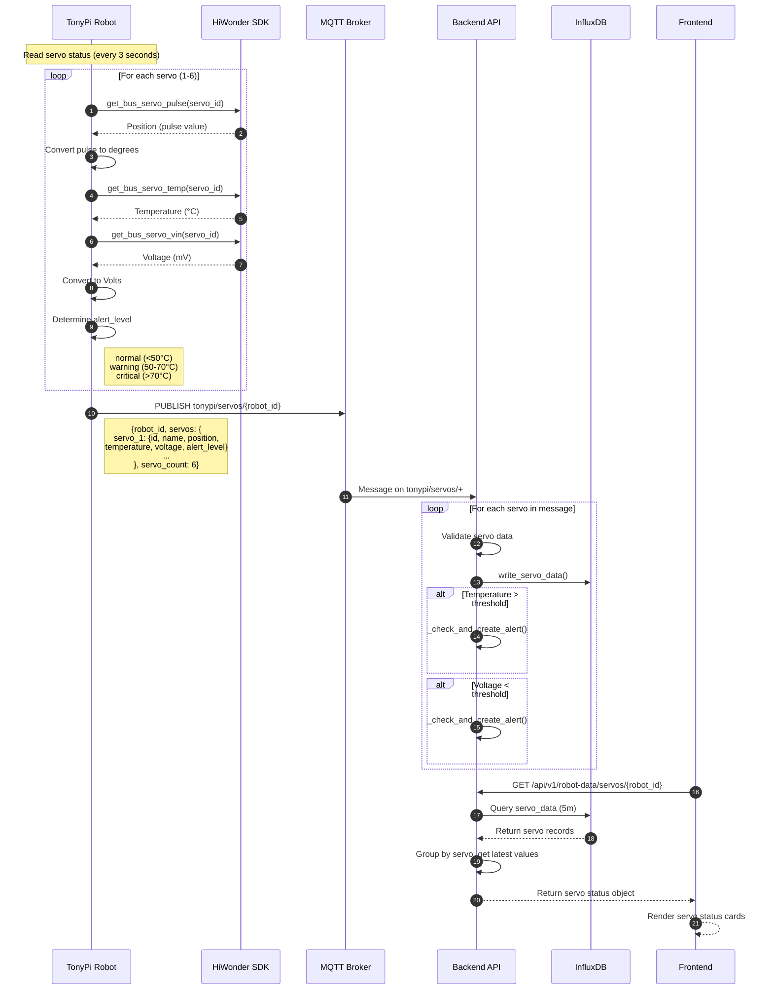
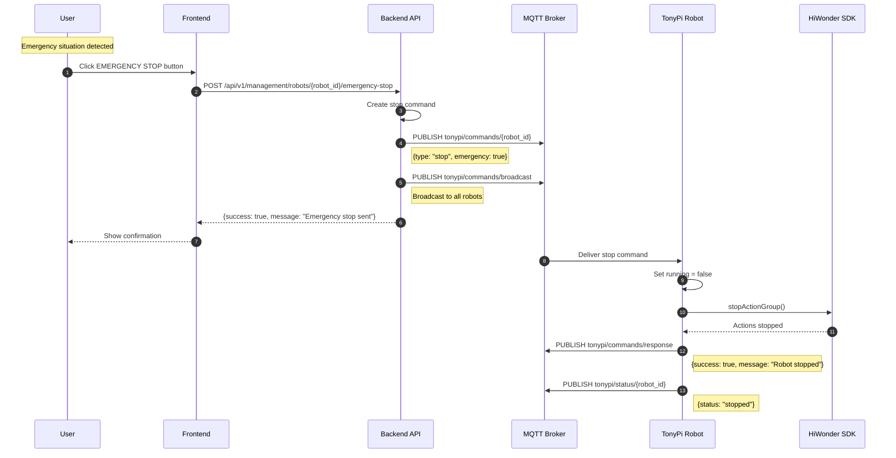

# TonyPi Robot Monitoring System - Sequence Diagrams

This document contains sequence diagrams showing the interactions between system components.

## System Components

| Component | Technology | Description |
|-----------|------------|-------------|
| Frontend | React + TypeScript | Web dashboard for monitoring and control |
| Backend | FastAPI (Python) | REST API server |
| MQTT Broker | Mosquitto | Message broker for robot communication |
| InfluxDB | Time-series DB | Stores sensor telemetry data |
| PostgreSQL | Relational DB | Stores users, alerts, logs, reports |
| Grafana | Visualization | Dashboard panels and charts |
| Robot Client | Python | Runs on TonyPi robot hardware |

---

## 1. Robot Telemetry Data Flow

This diagram shows how sensor data flows from the robot to storage and visualization.

---

## 2. User Authentication Flow

---

## 3. Robot Command Flow

This diagram shows how commands are sent from the frontend to the robot.

---

## 4. QR Code Scan & Job Progress Flow

---

## 5. Alert Management Flow

---

## 6. Report Generation Flow

---

## 7. Vision Detection Flow

---

## 8. System Startup Sequence

---

## 9. Servo Monitoring Detail

---

## 10. Emergency Stop Flow

---

## Data Storage Summary

### InfluxDB Measurements (Time-Series)
| Measurement | Tags | Fields |
|-------------|------|--------|
| sensor_data | robot_id, sensor_type | value, unit |
| servo_data | robot_id, servo_id, servo_name, alert_level | position, temperature, voltage, torque_enabled |
| battery_status | robot_id, charging | percentage, voltage, is_charging |
| robot_location | robot_id | x, y, z |
| robot_status | robot_id, status_type | status, ip_address, camera_url, system_* |
| vision_data | robot_id, state, detection, label, nav_cmd | has_detection, confidence, bbox_*, center_x, is_locked |
| robot_logs | robot_id, level, source | message, level_num |

### PostgreSQL Tables (Relational)
| Table | Purpose |
|-------|---------|
| users | User accounts and authentication |
| robots | Robot registry and metadata |
| alerts | Alert records with thresholds |
| alert_thresholds | Configurable thresholds per metric |
| system_logs | System event logs |
| reports | Generated report records |
| jobs | Job definitions and status |

---

## MQTT Topics Summary

| Topic Pattern | Direction | Description |
|---------------|-----------|-------------|
| tonypi/sensors/{robot_id} | Robot → Backend | Sensor telemetry |
| tonypi/servos/{robot_id} | Robot → Backend | Servo status |
| tonypi/status/{robot_id} | Robot → Backend | System status |
| tonypi/battery | Robot → Backend | Battery status |
| tonypi/location | Robot → Backend | Location updates |
| tonypi/vision/{robot_id} | Robot → Backend | Vision detections |
| tonypi/logs/{robot_id} | Robot → Backend | Log messages |
| tonypi/commands/{robot_id} | Backend → Robot | Commands to specific robot |
| tonypi/commands/broadcast | Backend → Robot | Commands to all robots |
| tonypi/commands/response | Robot → Backend | Command execution results |
| tonypi/scan/{robot_id} | Robot → Backend | QR code scan events |
| tonypi/items/{robot_id} | Backend → Robot | Item lookup responses |
| tonypi/job/{robot_id} | Robot → Backend | Job progress updates |
