# TonyPi Monitoring System - Use Case Diagram

## System Overview

This document illustrates the use cases and actors of the TonyPi Robot Monitoring System.

---

## Actors

| Actor | Description |
|-------|-------------|
| **Admin** | Full system access including user management, system configuration, and all monitoring features |
| **Operator** | Can monitor robots, send commands, manage alerts, and generate reports |
| **Viewer** | Read-only access to dashboards, monitoring data, and reports |
| **TonyPi Robot** | The physical robot client that sends telemetry and receives commands |
| **System (Backend)** | Automated processes for data processing, alert generation, and threshold monitoring |
| **Gemini AI** | External AI service for analytics and report generation |

---

## Complete Use Case Diagram (Mermaid)


---

## Use Case Diagram (Simplified View)

```mermaid
flowchart LR
    subgraph Users["Human Actors"]
        Admin((Admin))
        Operator((Operator))
        Viewer((Viewer))
    end

    subgraph TonyPiSystem["TonyPi Monitoring System"]
        direction TB
        Auth["🔐 Authentication<br/>Login, Logout, Profile"]
        UserMgmt["👥 User Management<br/>CRUD Users, Roles"]
        RobotMgmt["🤖 Robot Management<br/>Register, Configure, Delete"]
        Control["🎮 Robot Control<br/>Commands, Emergency Stop"]
        Monitor["📊 Monitoring<br/>Dashboard, Sensors, Servos"]
        AlertMgmt["🚨 Alerts<br/>View, Acknowledge, Resolve"]
        ReportGen["📑 Reports<br/>Generate, Download, AI Analysis"]
        LogView["📋 Logs<br/>View, Filter, Export"]
        JobTrack["📦 Jobs<br/>Progress, Summary"]
    end

    subgraph External["External Actors"]
        Robot((TonyPi Robot))
        AI((Gemini AI))
    end

    Admin -->|full access| Auth
    Admin -->|manage| UserMgmt
    Admin -->|configure| RobotMgmt
    Admin -->|control| Control
    Admin -->|view| Monitor
    Admin -->|manage| AlertMgmt
    Admin -->|generate| ReportGen
    Admin -->|view| LogView
    Admin -->|track| JobTrack

    Operator -->|access| Auth
    Operator -->|view| RobotMgmt
    Operator -->|control| Control
    Operator -->|view| Monitor
    Operator -->|manage| AlertMgmt
    Operator -->|generate| ReportGen
    Operator -->|view| LogView
    Operator -->|track| JobTrack

    Viewer -->|access| Auth
    Viewer -->|view only| Monitor
    Viewer -->|view| AlertMgmt
    Viewer -->|view| ReportGen
    Viewer -->|view| LogView
    Viewer -->|view| JobTrack

    Robot -->|telemetry| Monitor
    Robot -->|receives| Control
    Robot -->|triggers| AlertMgmt
    Robot -->|updates| JobTrack

    AI -->|analyzes| ReportGen
```



---

## Detailed Use Case Descriptions

### 1. Authentication Use Cases

| Use Case | Actor(s) | Description | Preconditions | Postconditions |
|----------|----------|-------------|---------------|----------------|
| **UC1: Login** | All Users | User authenticates with username/password | Valid account exists | JWT token issued, session created |
| **UC2: Logout** | All Users | User ends their session | User is logged in | Token invalidated, session ended |
| **UC3: View Profile** | All Users | User views their account details | User is logged in | Profile information displayed |

### 2. User Management Use Cases (Admin Only)

| Use Case | Actor(s) | Description | Preconditions | Postconditions |
|----------|----------|-------------|---------------|----------------|
| **UC4: Create User** | Admin | Create new user account | Admin logged in | New user created with role |
| **UC5: Update User** | Admin | Modify user details | User exists | User record updated |
| **UC6: Delete User** | Admin | Remove user account | User exists, not self | User deactivated/deleted |
| **UC7: View Users** | Admin | List all system users | Admin logged in | User list displayed |
| **UC8: Assign Role** | Admin | Change user's role | User exists | Role updated |

### 3. Robot Management Use Cases

| Use Case | Actor(s) | Description | Preconditions | Postconditions |
|----------|----------|-------------|---------------|----------------|
| **UC9: View Robot List** | All Users | Display all registered robots | User logged in | Robot grid shown |
| **UC10: Register Robot** | Admin | Add new robot to system | Admin logged in | Robot record created |
| **UC11: Update Robot Settings** | Admin | Modify robot configuration | Robot exists | Settings saved |
| **UC12: Delete Robot** | Admin | Remove robot from system | Robot exists | Robot deactivated |
| **UC13: View Robot Details** | All Users | View specific robot info | Robot exists | Details displayed |

### 4. Robot Control Use Cases

| Use Case | Actor(s) | Description | Preconditions | Postconditions |
|----------|----------|-------------|---------------|----------------|
| **UC14: Send Movement Command** | Admin, Operator | Send move/turn command | Robot online | Command sent via MQTT |
| **UC15: Emergency Stop** | Admin, Operator | Immediately stop robot | Robot online | Robot stops all actions |
| **UC16: Request Status** | Admin, Operator | Query robot's current state | Robot online | Status returned |
| **UC17: Send Head Commands** | Admin, Operator | Control head nod/shake | Robot online | Action executed |
| **UC18: Shutdown Robot** | Admin | Remotely shutdown robot | Robot online, Admin | Robot shuts down |

### 5. Monitoring Use Cases

| Use Case | Actor(s) | Description | Preconditions | Postconditions |
|----------|----------|-------------|---------------|----------------|
| **UC19: View Dashboard** | All Users | View main overview page | User logged in | Dashboard displayed |
| **UC20: View System Performance** | All Users | View CPU, Memory, Disk, Temp | User logged in | Performance metrics shown |
| **UC21: View Sensor Data** | All Users | View IMU, light, ultrasonic data | User logged in | Sensor charts displayed |
| **UC22: View Servo Status** | All Users | View servo positions, temps | User logged in | Servo status cards shown |
| **UC23: View Camera Stream** | All Users | Watch live camera feed | Robot has camera | Video stream displayed |
| **UC24: View Robot Location** | All Users | View robot position/coordinates | User logged in | Location map shown |
| **UC25: View Battery Status** | All Users | View battery level/voltage | User logged in | Battery info displayed |

### 6. Alert Management Use Cases

| Use Case | Actor(s) | Description | Preconditions | Postconditions |
|----------|----------|-------------|---------------|----------------|
| **UC26: View Alerts** | All Users | List all system alerts | User logged in | Alerts displayed |
| **UC27: Acknowledge Alert** | Admin, Operator | Mark alert as seen | Alert exists | Alert marked acknowledged |
| **UC28: Resolve Alert** | Admin, Operator | Mark alert as resolved | Alert exists | Alert marked resolved |
| **UC29: Configure Thresholds** | Admin | Set alert threshold values | Admin logged in | Thresholds saved |
| **UC30: View Alert Statistics** | All Users | View alert summary stats | User logged in | Statistics displayed |

### 7. Report Use Cases

| Use Case | Actor(s) | Description | Preconditions | Postconditions |
|----------|----------|-------------|---------------|----------------|
| **UC31: View Reports** | All Users | List generated reports | User logged in | Report list displayed |
| **UC32: Generate Report** | Admin, Operator | Create new report | Data available | Report generated |
| **UC33: Download PDF** | All Users | Export report as PDF | Report exists | PDF downloaded |
| **UC34: AI Performance Analysis** | Admin, Operator, Gemini AI | Get AI insights on data | Gemini API configured | AI analysis included |

### 8. Log Use Cases

| Use Case | Actor(s) | Description | Preconditions | Postconditions |
|----------|----------|-------------|---------------|----------------|
| **UC35: View System Logs** | All Users | View system event logs | User logged in | Logs displayed |
| **UC36: Filter Logs** | Admin, Operator | Filter logs by criteria | User logged in | Filtered results shown |
| **UC37: Export Logs** | Admin | Export logs to file | Admin logged in | Logs exported |

### 9. Job Tracking Use Cases

| Use Case | Actor(s) | Description | Preconditions | Postconditions |
|----------|----------|-------------|---------------|----------------|
| **UC38: View Job Progress** | All Users | View current job status | Job exists | Progress displayed |
| **UC39: View Job Summary** | All Users | View job completion stats | User logged in | Summary shown |
| **UC40: Track Items Scanned** | All Users | View scanned QR items | Job in progress | Items list displayed |

### 10. Robot Client Use Cases

| Use Case | Actor(s) | Description | Preconditions | Postconditions |
|----------|----------|-------------|---------------|----------------|
| **UC41: Connect to MQTT** | TonyPi Robot | Establish MQTT connection | Broker available | Connected to broker |
| **UC42: Publish Telemetry** | TonyPi Robot | Send sensor/status data | Connected to MQTT | Data published |
| **UC43: Receive Commands** | TonyPi Robot | Listen for control commands | Subscribed to topics | Commands received |
| **UC44: Execute Actions** | TonyPi Robot | Perform commanded actions | Command received | Action completed |
| **UC45: Scan QR Code** | TonyPi Robot | Detect and read QR codes | Camera active | QR data published |
| **UC46: Stream Camera** | TonyPi Robot | Provide live video feed | Camera available | MJPEG stream active |
| **UC47: Report Job Progress** | TonyPi Robot | Update job completion % | Job active | Progress published |

### 11. System Automated Use Cases

| Use Case | Actor(s) | Description | Preconditions | Postconditions |
|----------|----------|-------------|---------------|----------------|
| **UC48: Process Telemetry Data** | System | Parse and validate data | Data received | Data processed |
| **UC49: Check Thresholds** | System | Compare values to limits | Thresholds configured | Thresholds evaluated |
| **UC50: Generate Alerts** | System | Create alert on violation | Threshold exceeded | Alert created |
| **UC51: Update Robot Status** | System | Update robot's last seen | Status received | Robot record updated |
| **UC52: Store Time-Series Data** | System | Write to InfluxDB | Data validated | Data persisted |

---

## Access Control Matrix

| Use Case Category | Admin | Operator | Viewer |
|-------------------|:-----:|:--------:|:------:|
| **Authentication** | ✅ | ✅ | ✅ |
| **User Management** | ✅ | ❌ | ❌ |
| **Robot Registration** | ✅ | ❌ | ❌ |
| **Robot Configuration** | ✅ | ❌ | ❌ |
| **View Robots** | ✅ | ✅ | ✅ |
| **Robot Control** | ✅ | ✅ | ❌ |
| **Emergency Stop** | ✅ | ✅ | ❌ |
| **Shutdown Robot** | ✅ | ❌ | ❌ |
| **View Monitoring Data** | ✅ | ✅ | ✅ |
| **View Alerts** | ✅ | ✅ | ✅ |
| **Acknowledge/Resolve Alerts** | ✅ | ✅ | ❌ |
| **Configure Thresholds** | ✅ | ❌ | ❌ |
| **Generate Reports** | ✅ | ✅ | ❌ |
| **View Reports** | ✅ | ✅ | ✅ |
| **Download PDF** | ✅ | ✅ | ✅ |
| **View Logs** | ✅ | ✅ | ✅ |
| **Filter/Export Logs** | ✅ | ✅ | ❌ |
| **View Jobs** | ✅ | ✅ | ✅ |

---

## Use Case Relationships

### Include Relationships
- **Generate Report** includes **AI Performance Analysis** (when AI is enabled)
- **Generate Alerts** includes **Check Thresholds**
- **Send Movement Command** includes **Publish via MQTT**

### Extend Relationships
- **View Dashboard** extends to **View Detailed Performance** (on user request)
- **View Alerts** extends to **Configure Thresholds** (for admin users)

### Generalization
- **Admin** generalizes **Operator** (Admin has all Operator capabilities plus more)
- **Operator** generalizes **Viewer** (Operator has all Viewer capabilities plus more)

---

## System Boundary

```
┌─────────────────────────────────────────────────────────────────────────────────┐
│                        TonyPi Monitoring System Boundary                         │
│                                                                                  │
│  ┌─────────────────┐  ┌─────────────────┐  ┌─────────────────┐                 │
│  │   Web Frontend  │  │  Backend API    │  │   Databases     │                 │
│  │   (React.js)    │  │   (FastAPI)     │  │ PostgreSQL/     │                 │
│  │                 │  │                 │  │ InfluxDB        │                 │
│  └────────┬────────┘  └────────┬────────┘  └────────┬────────┘                 │
│           │                    │                     │                          │
│           └────────────────────┴─────────────────────┘                          │
│                                │                                                 │
│                    ┌───────────┴───────────┐                                    │
│                    │     MQTT Broker       │                                    │
│                    │     (Mosquitto)       │                                    │
│                    └───────────┬───────────┘                                    │
│                                │                                                 │
└────────────────────────────────┼────────────────────────────────────────────────┘
                                 │
                    Outside System Boundary
                                 │
              ┌──────────────────┼──────────────────┐
              │                  │                  │
        ┌─────┴─────┐     ┌──────┴──────┐    ┌─────┴─────┐
        │  TonyPi   │     │  Gemini AI  │    │  Grafana  │
        │  Robot    │     │  (Google)   │    │           │
        └───────────┘     └─────────────┘    └───────────┘
```

---

## Technology Mapping

| Use Case Category | Frontend Component | Backend Router | Database |
|-------------------|-------------------|----------------|----------|
| Authentication | `Login.tsx`, `AuthContext.tsx` | `users.py` | PostgreSQL |
| User Management | `Users.tsx` | `users.py` | PostgreSQL |
| Robot Management | `Robots.tsx` | `robots_db.py` | PostgreSQL |
| Robot Control | `Robots.tsx` | `management.py` | MQTT |
| Monitoring | `Dashboard.tsx`, `Monitoring.tsx`, `Sensors.tsx`, `Servos.tsx` | `robot_data.py`, `pi_perf.py` | InfluxDB |
| Alerts | `Alerts.tsx` | `alerts.py` | PostgreSQL |
| Reports | `Reports.tsx` | `reports.py` | PostgreSQL, InfluxDB |
| Logs | `Logs.tsx` | `logs.py` | PostgreSQL |
| Jobs | `Jobs.tsx` | `robot_data.py` | In-Memory (JobStore) |
